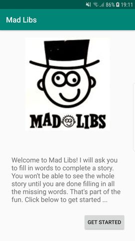
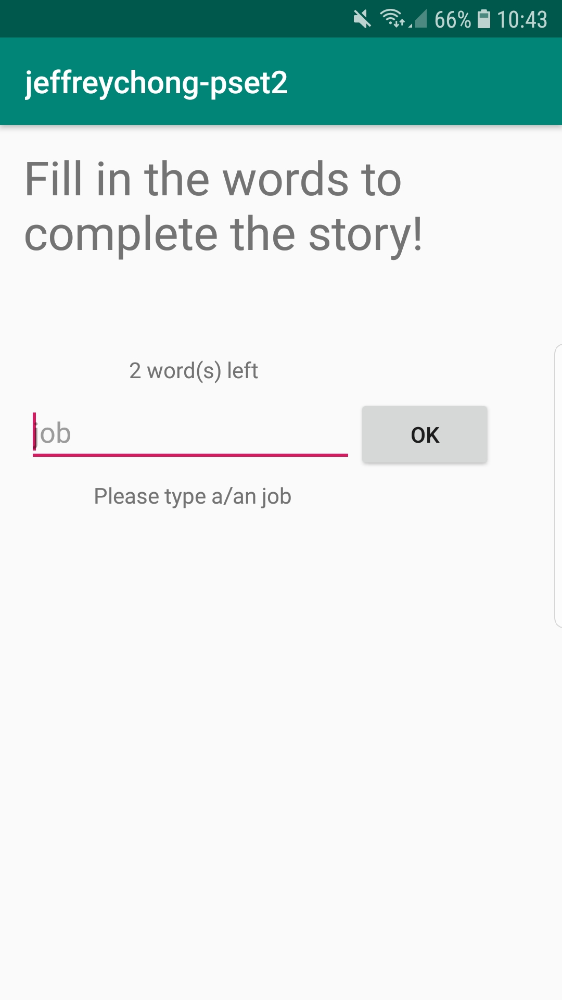
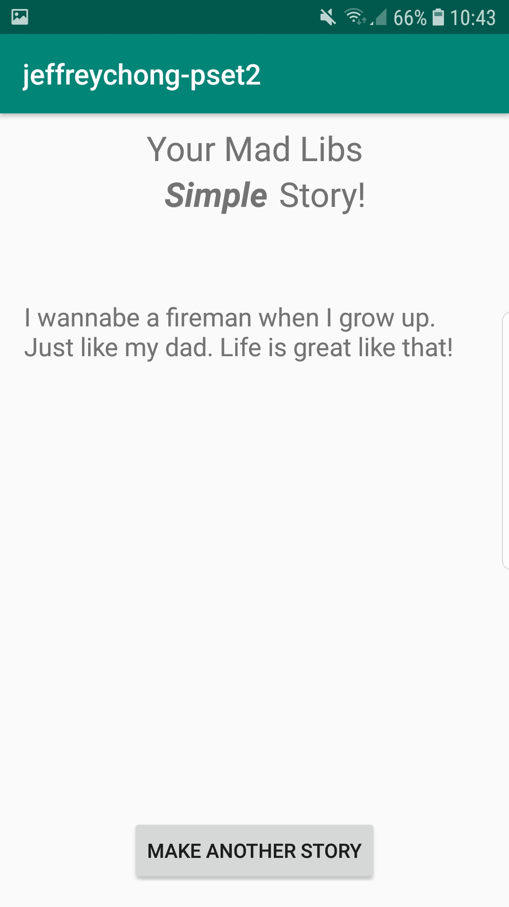

# MadLibs

Jeffery Chong, 11304669. 
App Studio, week 2. 

Android users can choose one of the 5 stories. Some words in the stories are kept blank. 
It is up to the user to add the words. After all the words are prompt, 
the app wil display the full story with the inserted words from the user. 

 
 
 

