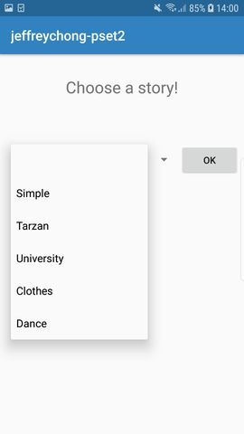
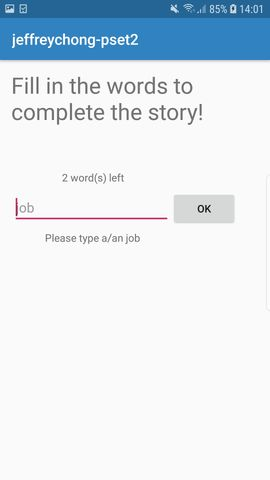
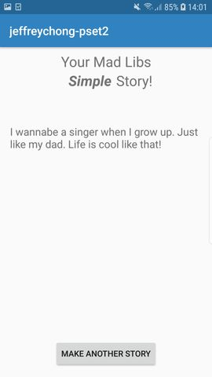

# MadLibs

Jeffrey Chong, 11304669. 
App Studio, week 2. 

Android users can choose one of the 5 stories in this MadLibs app. 
Some words in the stories are kept blank. 
It is up to the user to add the words. After all the words are prompt, 
the app wil display the full story with the inserted words from the user. 

Extra:
- a drop down menu (spinner) when a story can be chosen (second picture, Activity2.java OnCreate). 
- The title changes in the last activity, based on which story the user has chosen (last picture, Activity4.java OnCreate). 

